<h1 align="center">GreenPlate</h1>

<div align="center">
   
</div>  
<br>

> [플레이 데이터] 한화시스템 BEYOND SW캠프  
> 6기 1차 프로젝트 팀 404x
## 🤚 404x 팀원
<table>
 <tr>
    <td align="center"><a href="https://github.com/ohgyulim"></td>
    <td align="center"><a href="https://github.com/wns2212"></td>
    <td align="center"><a href="https://github.com/dyun23"></td>
    <td align="center"><a href="https://github.com/lrkdms125"></td>
    <td align="center"><a href="https://github.com/winter0123"></td>
  </tr>
  <tr>
    <td align="center"><b>Team Leader</b> <br> <a href="https://github.com/ohgyulim"><b>오규림</b></td>
    <td align="center"><a href="https://github.com/wns2212"><b>권준형</b></td>
    <td align="center"><a href="https://github.com/dyun23"><b>김다윤</b></td>
    <td align="center"><a href="https://github.com/dlrkdms125"><b>이가은</b></td>
    <td align="center"><a href="https://github.com/winter0123"><b>장유정</b></td>
  </tr>
  </table>

## 📌 프로젝트 주제 
### 건강한 삶을 위한 나만의 식재료 추천 사이트 
레시피를 추천해주고, 레시피 속 필요한 재료를 한 번에 담을 수 있는 기능을 제공

레시피에 사용된 재료 각각의 칼로리를 보여주고, 장바구니에 상품을 담았을 때 장바구니에 담긴 전체 상품의 칼로리 합계를 보여주는 기능 

라이브 스트리밍과 커머스의 합성어인 라이브커머스 서비스 제공  
[추가 자료](https://github.com/beyond-sw-camp/be06-1st-404x-GreenPlate/wiki/%ED%94%84%EB%A1%9C%EC%A0%9D%ED%8A%B8-%EA%B0%9C%EC%9A%94)

## 🔧 기술 스택
운영 환경  
    
DB  
  
모니터링  
   
협업 툴  
    
[세부 사항 위키](https://github.com/beyond-sw-camp/be06-1st-404x-GreenPlate/wiki/%EA%B8%B0%EC%88%A0-%EC%8A%A4%ED%83%9D)

## 📄 요구사항 명세서
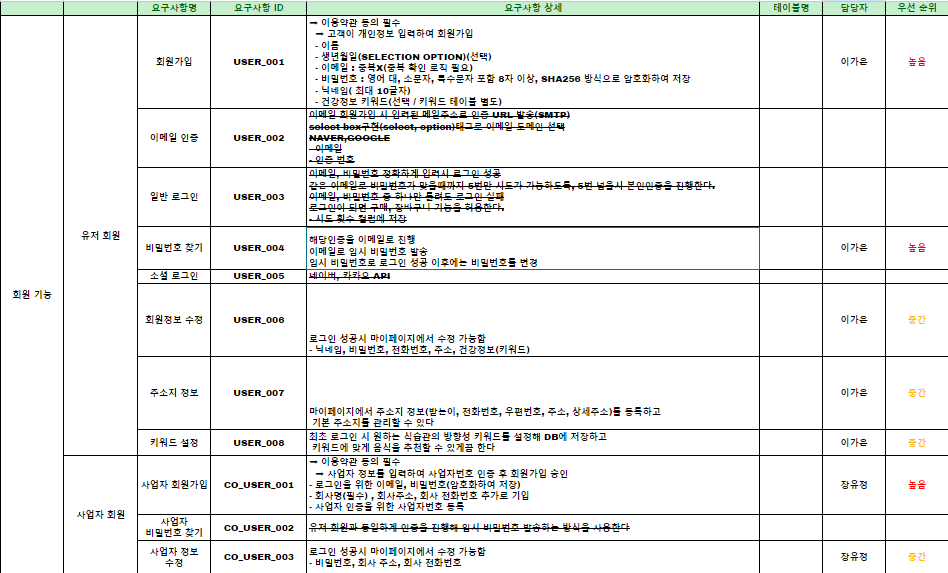
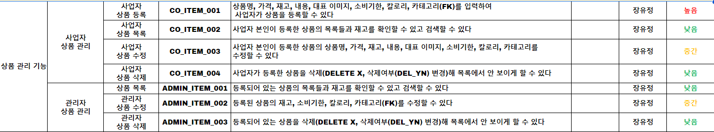
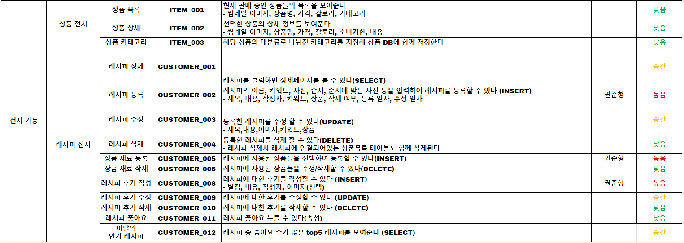
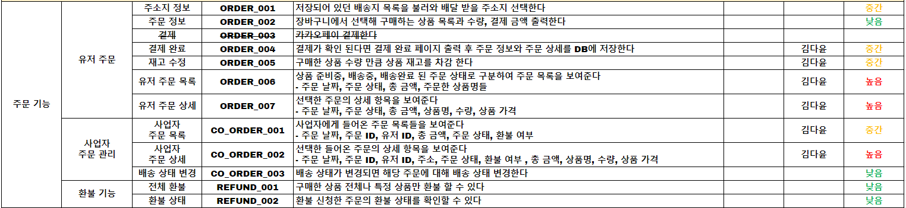
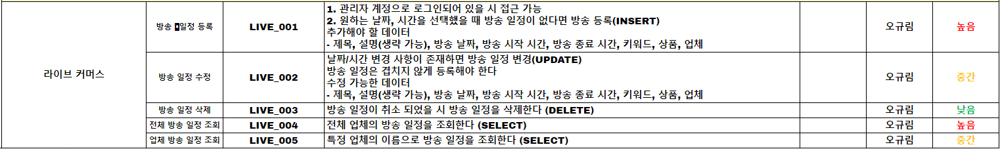

[스프레드 시트 링크](https://docs.google.com/spreadsheets/d/18xtuXo7vrMqQ2GdFQdnLxmKsj9kOOjgsPDi9ZospRJM/edit#gid=0)


## ERD 다이어그램
     
  
[ERD 링크](https://www.erdcloud.com/d/f3onDN2odBNSReR5x)

## 🖥️ 시스템 아키텍처
   

## ✨ DR(재난 복구)
**DB 서버 : Active - Active**

각각의 서버가 Master, Slave 역할을 동시에 수행한다.

**Active - Active 선택 이유**
- 양방향 복제를 통해 **두 서버는 항상 동일한 데이터를 유지**할 수 있다.
- 두 서버의 데이터가 일관되게 유지되기 때문에 **로드 밸런서로 부하를 분산**시킬 수 있다.
- 한 서버에 문제가 생기더라도 다른 서버로 요청을 지속적으로 처리할 수 있어서 **에러 대처 능력**이 뛰어나다.
- 이커머스 특성 상, **상품을 사용자에게 보여주는 부분이 많기 때문에** 빠른 속도로 상품을 보여주기 위해 클러스터 방식보단 Active - Active 구성이 더 적합하다고 판단했다.

**재난 복구 계획**
- 프로메테우스, 그라파나와 같은 모니터링 시스템을 통해 DB 서버의 상태를 확인한다.
- DB 서버에 문제가 발생했을 경우, 문제가 발생하지 않은 DB 서버의 로그 파일을 기반으로 문제 DB 서버를 복구한다.


## 📚 SQL 실행 결과
[DDL 코드](https://github.com/beyond-sw-camp/be06-1st-404x-GreenPlate/blob/main/ddl.sql)
<details>
<summary>회원 기능</summary>
<div>

- 회원 가입
    ```python
    INSERT INTO 'USER' ('NAME', 'BIRTHDAY', 'EMAIL', 'PW', 'NICKNAME', 'KEYWORD')
    VALUES ('홍길동', '1990-01-01', 'example@example.com', 'mypassword', 'honggd', '건강 정보 내용')
    ```
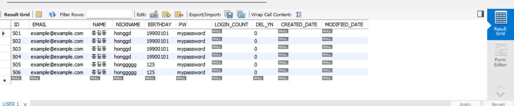

- 비밀번호 찾기
```python
UPDATE USER
SET 비밀번호_해시 = 'new_hashed_password',
    임시비밀번호_요청여부 = 0
WHERE EMAIL = 'user@example.com';
```
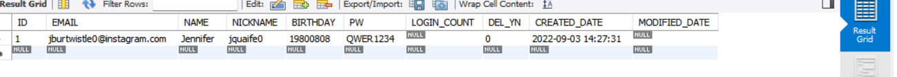
  
- 회원 정보 수정
```python
UPDATE USER
SET NICKNAME = 'new_user123',
PW = 'new_hashed_password',
PHONE_NUM = '010-9876-5432',
ADDRESS = '새로운 주소',
KEYWORD = '새로운 건강정보'
WHERE USER_ID = 'user123';
```
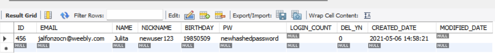
  
- 주소지 정보
```python
INSERT INTO 'USER' ('ID', 'KEYWORD_NAME')
VALUES ('사용자ID값', 'KEYWORD_NAME');
```
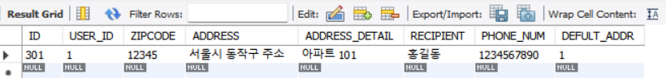

- 사업자 회원가입
```sql
INSERT INTO `COMPANY` (`EMAIL`, `PW`, `BIZ_NAME`, `BIZ_NO`, `ADDRESS`, `TEL`, `DEL_YN`, `CREATED_DATE`, `MODIFIED_DATE`) 
VALUES ('applecompany@example.com', 'password123', '사과를파는회사', '45645', '서울시 동작구 사과를파는 회사 주소', '01012345678', 0, NOW(), NOW());
```
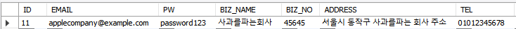  
  
- 사업자 정보 수정

```sql
UPDATE `COMPANY`
SET `PW` = 'new_password1234',    
	`BIZ_NAME` = '바나나를 파는 회사였어요',    
	`BIZ_NO` = '12345678',    
	`ADDRESS` = '서울시 강서구 바나나파는회사',    
	`TEL` = '01012345678',    
	`MODIFIED_DATE` = NOW()
WHERE `ID` = (SELECT ID FROM COMPANY WHERE `EMAIL` = [사업자 EMAIL]);
```
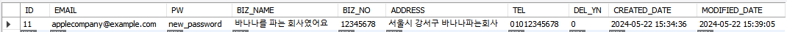
</div>
</details>

<details>
<summary>상품 관리 기능</summary>

- 사업자 상품 등록
```sql
INSERT INTO `ITEM` (`CATEGORY_ID`, `COMPANY_ID`, `NAME`, `EXPLAIN`, `PRICE`, `STOCK`, `CALORIE`, `IMAGE_URL1`, `EXPIRATION_DATE`, `DEL_YN`, `CREATED_DATE`, `MODIFIED_DATE`) 
VALUES (2, 1, '맛있는 로컬 바나나', '이것은 맛있는 로컬바나나입니다.', 10000, 10, '150', NULL, NULL, 0, NOW(), NOW());
```

- 특정 사업자 상품목록

```sql
SELECT * FROM item WHERE COMPANY_ID=[검색할 회사 ID] AND `DEL_YN` = 0;
```


- 사업자 상품 수정

```sql
UPDATE `ITEM`
SET `NAME` = '맛있는 서울 바나나',    
	`EXPLAIN` = '이것은 서울에서 재배한 바나나입니다.',    
	`PRICE` = 15000,   
	`STOCK` = 150,    
	`CALORIE` = 200, 
	`MODIFIED_DATE`=now()
WHERE `ID` = [검색할 ITEM ID];
```


- 관리자 상품 목록

```sql
SELECT * FROM item WHERE `DEL_YN` = 0;
```

</div>
</details>


<details>
<summary>전시 기능</summary>

- 레시피 전시_레시피 등록
```sql
INSERT INTO RECIPE (USER_ID, TITLE, CONTENTS, NAME, LIKES, DEL_YN, CREATED_DATE, MODIFIED_DATE)
VALUES (9, '닭가슴살 볶음밥', '닭가슴살 볶음밥', NULL, NULL, NULL, NOW(), NOW());
```
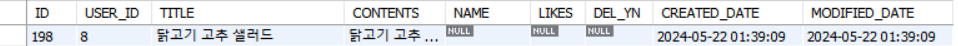

- 레시피 전시_상품 재료 등록

```sql
INSERT INTO RECIPE_ITEM (RECIPE_ID, ITEM_ID)
VALUES (22, 1);
```


- 레시피 전시_레시피 후기 작성

```sql
INSERT INTO REVIEW (RECIPE_ID, USER_ID, STAR_POINT, CONTENT, IMAGE_URL)
VALUES
(145, 15, 5, 'Excellent recipe!', 'image5.jpg');
```


- 레시피 전시_레시피 수정
```sql
UPDATE RECIPE
SET
TITLE = '수정된 당근레시피에요',
CONTENTS = '수정된 당근레시피 내용이지요',
MODIFIED_DATE = NOW()
WHERE ID = 1;
```

</div>

</details>

<details>
<summary>주문 기능</summary>
<div>
  
- 주문 저장
```sql
## 임시로 데이터 지정
INSERT INTO ORDERS(USER_ID, ADDRESS_ID, ORDER_DATE, TOTAL_PRICE, TOTAL_CNT, ORDER_STATE, REFUND_YN, DEL_YN, CREATED_DATE) 
VALUES (19, 203, NOW(), 1977.177, 2, '배송준비', 0, 0, NOW());
INSERT INTO ORDER_DETAILS(ORDERS_ID, ITEM_ID, CNT, PRICE, REFUND_YN, DEL_YN, CREATED_DATE) 
VALUES (51, 3, 1, 980.953,  0, 0, NOW()); ## 상품 종류 수 만큼 생성
INSERT INTO ORDER_DETAILS(ORDERS_ID, ITEM_ID, CNT, PRICE, REFUND_YN, DEL_YN, CREATED_DATE) 
VALUES (51, 5, 1, 996.224, 0, 0, NOW());
```  
ORDERS
 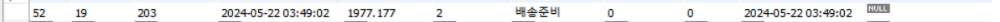
 ORDER_DETAILS
 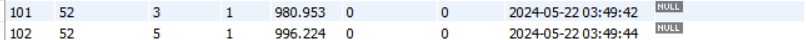

- 상품 재고 차감
```sql
## ordersId : 주문 추가된 ID
DELIMITER $$
CREATE PROCEDURE subtractStock(IN ordersId bigint)
BEGIN
    UPDATE ITEM
    SET STOCK = STOCK - 1
    WHERE ID IN (SELECT ITEM_ID
				FROM ORDER_DETAILS
                WHERE ORDERS_ID = ordersId);
END $$
DELIMITER ;

CALL subtractStock(52); ## 임의값:52
```
실행 전/후
 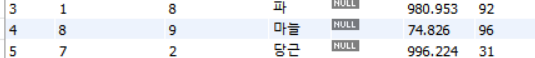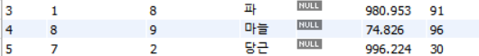 

- 유저 주문 목록
```sql
SELECT ORDER_DATE, ORDER_STATE, TOTAL_PRICE, NAME
FROM ORDERS JOIN ORDER_DETAILS AS TAILS
ON ORDERS.ID = TAILS.ORDERS_ID
JOIN ITEM ON TAILS.ITEM_ID = ITEM.ID
WHERE USER_ID = [검색할 유저 ID]; ## 임시값:22
```
 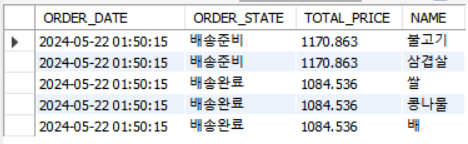  
   
- 유저 주문 상세
```sql
SELECT ORDER_DATE, ORDER_STATE, TOTAL_PRICE, NAME, CNT, TAILS.PRICE
FROM ORDERS LEFT JOIN ORDER_DETAILS AS TAILS
ON ORDERS.ID = TAILS.ORDERS_ID
LEFT JOIN ITEM ON TAILS.ITEM_ID = ITEM.ID
WHERE ORDERS.ID = [선택한 주문 ID]; ## 임시값:50
```
 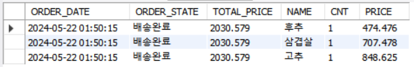  

- 사업자 주문 목록
```sql
SELECT COMPANY_ID, ORDER_DATE, TOTAL_PRICE, ORDER_STATE, TAILS.REFUND_YN
FROM ORDERS
JOIN ORDER_DETAILS AS TAILS
ON ORDERS.ID = TAILS.ORDERS_ID
JOIN ITEM ON TAILS.ITEM_ID = ITEM.ID
WHERE COMPANY_ID = [로그인한 사업자 ID]; ## 임시값:3
```
 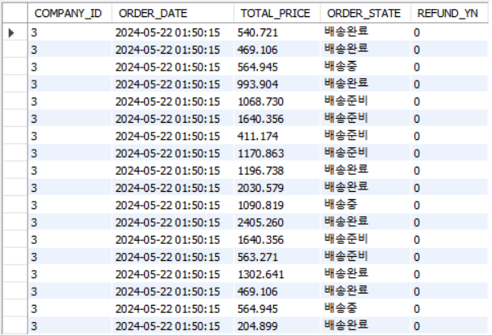  

- 사업자 주문 상세
```sql
## ordersId : 선택한 주문 ID
DELIMITER $$
CREATE PROCEDURE coOrdersDetail (IN ordersId bigint)
BEGIN
    SELECT ORDERS.ID, ORDERS.USER_ID, 
		RECIPIENT, PHONE_NUM, ZIPCODE, ADDRESS, ADDRESS_DETAIL, ORDER_STATE, TOTAL_PRICE,
		NAME, CNT, TAILS.PRICE
	FROM ADDRESS
	JOIN ORDERS ON ADDRESS.ID = ORDERS.ADDRESS_ID
	JOIN ORDER_DETAILS AS TAILS
	ON ORDERS.ID = TAILS.ORDERS_ID
	JOIN ITEM ON TAILS.ITEM_ID = ITEM.ID
	WHERE ORDERS.ID = ordersId;
END $$
DELIMITER ;

CALL coOrdersDetail(50); ## 임시값:50
```
 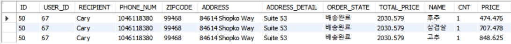  
</div>
</details>

<details>
<summary>라이브 커머스</summary>
<div>
  
- 방송 일정 등록
```sql
-- 함수 등록
DELIMITER $$
CREATE PROCEDURE addLiveCommerce(IN MANAGER_ID BIGINT, IN COMPANY_ID BIGINT,
IN TITLE VARCHAR(30), IN DESCRIPTION VARCHAR(100), IN LIVE_DATE DATE, IN START_TIME DATETIME, IN END_TIME DATETIME)
BEGIN
	DECLARE result INT default 0;
    SET result = (
    SELECT count(*) FROM LIVECOMMERCE 
    WHERE LIVECOMMERCE.ID = ID AND LIVECOMMERCE.START_TIME >= START_TIME AND LIVECOMMERCE.END_TIME <= END_TIME
    );
    IF result = 0 THEN
    INSERT INTO LIVECOMMERCE (MANAGER_ID, COMPANY_ID, TITLE, DESCRIPTION, LIVE_DATE, START_TIME, END_TIME) VALUE
    (MANAGER_ID, COMPANY_ID, TITLE, DESCRIPTION, LIVE_DATE, START_TIME, END_TIME);
    END IF;
END $$
DELIMITER ;

-- 함수 호출
CALL addLiveCommerce(2, 4, '맥북 특가!', '맥북 특가 라이브 커머스 입니다.', '2024-06-23', '2024-06-28 22:00:00', '2024-06-28 23:00:00');
```
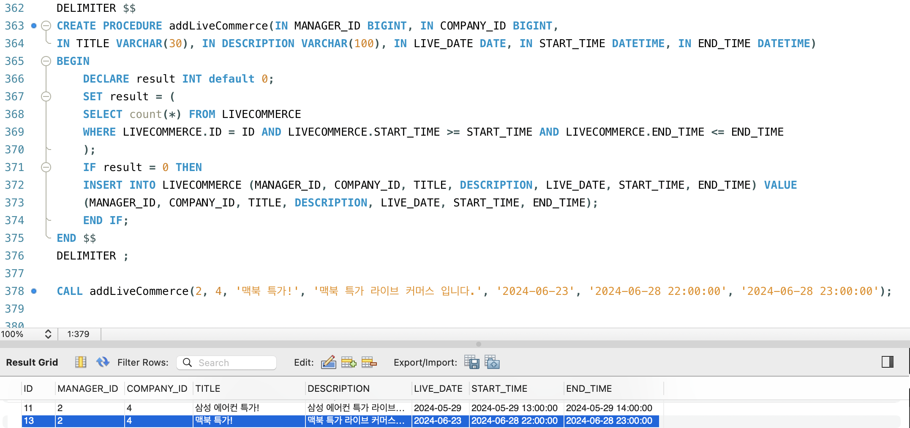  
  
- 방송 일정 수정

```sql
--- 함수 선언
DELIMITER $$
CREATE PROCEDURE checkDate(IN ID BIGINT,IN MANAGER_ID BIGINT, IN COMPANY_ID BIGINT,
IN TITLE VARCHAR(30), IN DESCRIPTION VARCHAR(100), IN LIVE_DATE DATE, IN START_TIME DATETIME, IN END_TIME DATETIME)
BEGIN
	DECLARE result INT default 0;
    SET result = (
    SELECT count(*) FROM LIVECOMMERCE 
    WHERE LIVECOMMERCE.ID = ID AND LIVECOMMERCE.START_TIME >= START_TIME AND LIVECOMMERCE.END_TIME <= END_TIME
    );
    IF result = 0 THEN
		UPDATE LIVECOMMERCE SET
        LIVECOMMERCE.MANAGER_ID = MANAGER_ID,
        LIVECOMMERCE.COMPANY_ID = COMPANY_ID,
        LIVECOMMERCE.TITLE = TITLE,
        LIVECOMMERCE.DESCRIPTION = DESCRIPTION,
        LIVECOMMERCE.LIVE_DATE = LIVE_DATE,
        LIVECOMMERCE.START_TIME = START_TIME,
        LIVECOMMERCE.END_TIME = END_TIME
        WHERE LIVECOMMERCE.ID = ID;
	END IF;
END $$
DELIMITER ;

--- 함수 호출
CALL checkDate(13, 2, 4, '삼성 노트북 특가!', '삼성 노트북 특가 라이브 입니다.', '2024-06-29', '2024-06-29 22:00:00', '2024-06-29 23:00:00');
```
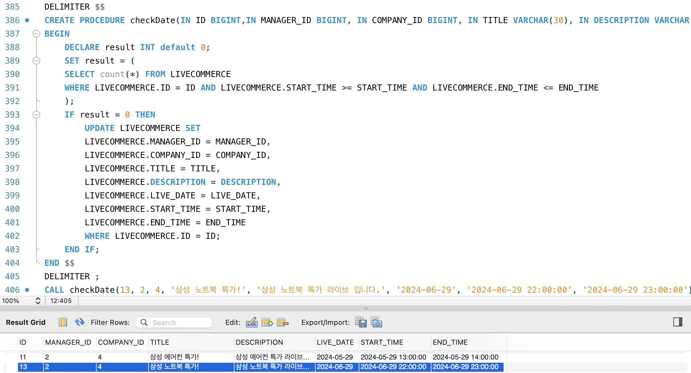  
  
- 전체 방송 일정 조회

```sql
SELECT * FROM LIVECOMMERCE;
```
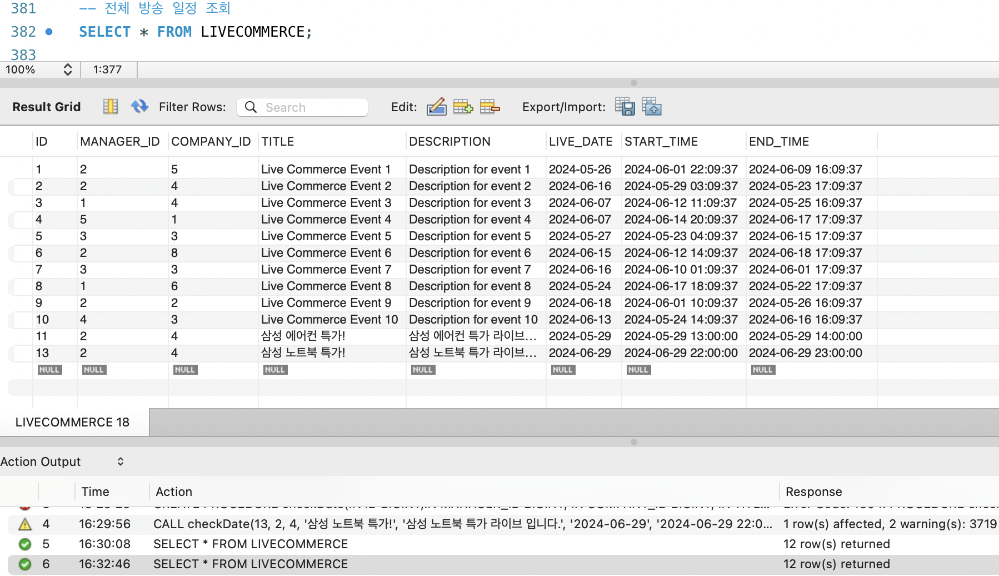  
  
- 업체 이름으로 방송 일정 조회

```sql
-- 함수 선언
 DELIMITER $$
CREATE PROCEDURE searchLCwithCommpanyName(IN BIZ_NAME VARCHAR(30))
BEGIN
	SELECT * FROM LIVECOMMERCE
	LEFT JOIN COMPANY
	ON LIVECOMMERCE.COMPANY_ID = COMPANY.ID
	WHERE COMPANY.BIZ_NAME = BIZ_NAME;
END $$
DELIMITER ;

-- 함수 호출
CALL searchLCwithCommpanyName('Kassulke Group');
```
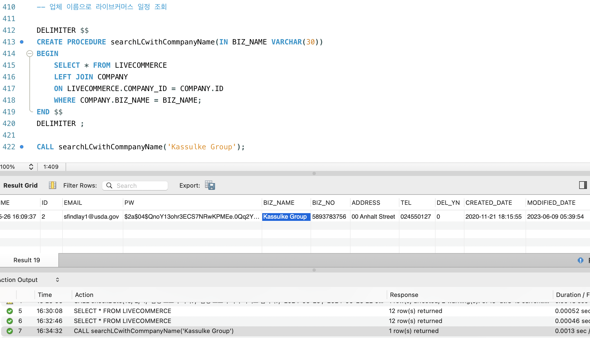  
</div>
</details>


