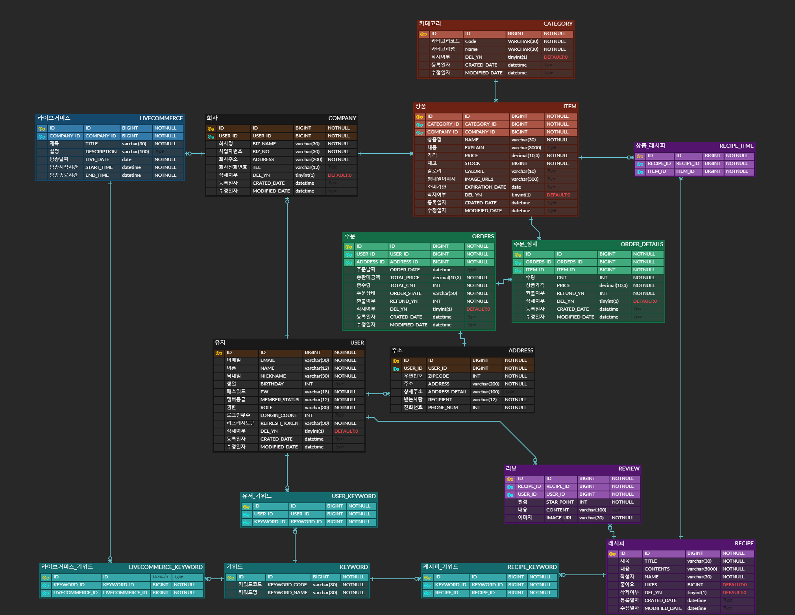
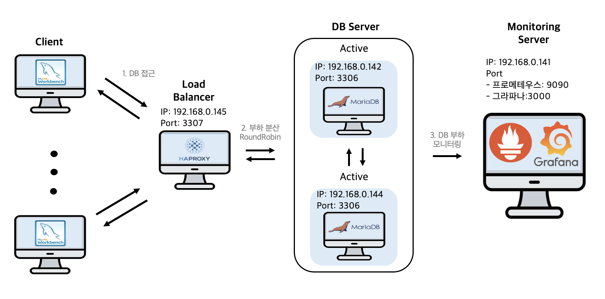

<h1 align="center">GreenPlate</h1>

   

  
 

> [플레이 데이터] 한화시스템 BEYOND SW캠프  
> 6기 1차 프로젝트 팀 404x
## 🤚 404x 팀원
<table>
 <tr>
    <td align="center"><a href="https://github.com/ohgyulim"></td>
    <td align="center"><a href="https://github.com/wns2212"></td>
    <td align="center"><a href="https://github.com/dyun23"></td>
    <td align="center"><a href="https://github.com/lrkdms125"></td>
    <td align="center"><a href="https://github.com/winter0123"></td>
  </tr>
  <tr>
    <td align="center"><b>Team Leader</b>   <a href="https://github.com/ohgyulim"><b>오규림</b></td>
    <td align="center"><a href="https://github.com/wns2212"><b>권준형</b></td>
    <td align="center"><a href="https://github.com/dyun23"><b>김다윤</b></td>
    <td align="center"><a href="https://github.com/dlrkdms125"><b>이가은</b></td>
    <td align="center"><a href="https://github.com/winter0123"><b>장유정</b></td>
  </tr>
  </table>

## 📌 프로젝트 주제 
### 건강한 삶을 위한 나만의 식재료 추천 사이트 
레시피를 추천해주고, 레시피 속 필요한 재료를 한 번에 담을 수 있는 기능을 제공

레시피에 사용된 재료 각각의 칼로리를 보여주고, 장바구니에 상품을 담았을 때 장바구니에 담긴 전체 상품의 칼로리 합계를 보여주는 기능 

라이브 스트리밍과 커머스의 합성어인 라이브커머스 서비스 제공
[추가 자료](https://github.com/beyond-sw-camp/be06-1st-404x-GreenPlate/wiki/%ED%94%84%EB%A1%9C%EC%A0%9D%ED%8A%B8-%EA%B0%9C%EC%9A%94)

## 🔧 기술 스택
운영 환경  
    
DB  
  
모니터링  
 
협업 툴  
    
[세부 사항 위키](https://github.com/beyond-sw-camp/be06-1st-404x-GreenPlate/wiki/%EA%B8%B0%EC%88%A0-%EC%8A%A4%ED%83%9D)

## 📄 요구사항 명세서
[스프레드 시트 링크](https://docs.google.com/spreadsheets/d/18xtuXo7vrMqQ2GdFQdnLxmKsj9kOOjgsPDi9ZospRJM/edit#gid=0)

## ERD 다이어그램
     
  
[ERD 링크](https://www.erdcloud.com/d/f3onDN2odBNSReR5x)

## 🖥️ 시스템 아키텍처
   

## ✨ DR(재난 복구)
- DB 서버 : Master - Slave 방식 사용  
DB의 요청의 절반 이상이 읽기 요청이기 때문에 Replication 구성 선택

## 📚 SQL 실행 결과
<!--

회원 가입

<figure align="center"> 
  
 </figure>

로그인

<figure align="center"> 

 </figure>

-->

